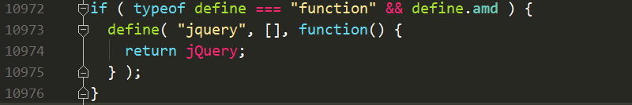

# 模块化

模块就是实现一个特定功能的一组代码，通常一个文件就是一个模块，我们前端模块化中，一个模块指的就是一个js文件。

模块化是把一个复杂的应用分解为很多的可管理的模块。

## 为什么要有模块化

模块化最早出现在服务端语言中，因为服务端的逻辑通常都非常的复杂，如果不使用模块进行管理，那么系统会变得难以维护。

现在的网站越来越复杂，功能越来越强大，嵌入网页的Javascript代码越来越庞大，越来越复杂。


前端模块化编程，已经成为一个迫切的需求。理想情况下，不同的开发者只需要实现不同核心的业务逻辑，其他都可以加载别人已经写好的模块。

因此最简单的模块化做法就是：把一个独立的功能的所有js代码放到一个单独的JS文件中，这就算是一个模块了。使用的时候只需要引入这个js文件即可。

- 容易造成全局变量污染
- 模块之间的依赖关系必须靠程序员自己维护。


**模块化的使用场景：在复杂的项目，越适合，如果是非常简单的项目，可以不使用模块化**


## 模块化的标准

有了模块，我们就可以更方便地使用别人的代码,想要什么功能，就加载什么模块。这样做有一个前提，那就是大家必须以同样的方式编写模块，否则你有你的写法，我有我的写法，岂不是乱了套！ 【螺丝与螺帽】

- CommonJS：是一个模块化的标准，Node.js在使用的模块化标准。适用与后端开发的标准。
- AMD（Async Module Definition）：在CommonJS基础上衍生出来的适用于前端开发的模块化标准。
  - 特点：预加载，第一次访问时，将所有的文件都加载出来。
  - 优点：第一次访问完成以后，再次访问速度会很快
  - 缺点：第一次加载，需要的时间会比较长
  - 代表：requirejs
- CMD（Common Module Definition）：在CommonJS基础上衍生出来的适用于前端开发的模块化标准。
  - 特点：懒加载，只有使用到的时候，才会加载对应的模块。
  - 优点：第一次访问速度会比较快
  - 缺点：再次访问其他模块时会比较慢。
  - 代表：seajs  


# require.JS

## require.js概念

requirejs是AMD规范的一个实现，require.js是一个javascript文件，也是一个模块加载器。**模块加载器：相当于canvas中封装的图片加载器，只不过一个是加载图片的，一个加载js，文件的类型不一样。** 

[官网地址](http://requirejs.org/)

[github地址](https://github.com/requirejs/requirejs)

requirejs主要提供两大功能：

+ 加载模块：可以加载AMD规范的模块，也可以是普通的模块，异步加载，并且能够管理模块之间的依赖。
+ 规范了模块的定义：有助于不同模块之间的共享与依赖。

requirejs的优点：

+ 提高了javascript文件的加载速度，避免不必要的堵塞。
+ 独特的模块定义方式可以避免全局变量污染。
+ 独特的模块定义方式可以在脚本层面声明模块之间的依赖。

## requirejs初体验

**一、引入js文件** 

```html
<!--1. 引入require.js文件-->
<script src="require.js"></script>
```

**二、定义模块** 

```javascript
//在a.js文件中
console.log("a模块加载了");
```

**三、引用模块** 

```javascript
//require会自动找当前目录下的js文件，a是文件名，不能写后缀。
require(["a"]);
```

## API详解

requirejs一共对外暴露三个全局变量 

1. requirejs  - 用于加载模块
2. require     - 用于加载模块
3. define      - 用于定义模块

**`require`和`requirejs`是同一个函数，类似于`$`和`jQuery`的关系** 

### require加载模块

+ 作用：加载模块（amd模块或者是普通模块）
+ 加载普通模块，模块加载完是会执行一遍的。

```javascript
//第一个参数：数组，需要加载的模块，异步加载的
//第二个参数：回调函数，在模块都加载完毕之后，回调函数才会执行
//require(["js/a", "js/b", "js/c"]);
require(["js/a", "js/b", "js/c"],function () {
  console.log("我是最后执行的");
});
```

### define定义模块

使用define函数可以定义一个AMD规范的模块

```javascript
//第一个参数：模块的依赖
//第二个参数：模块的主体
define([], function () {
  console.log("a模块加载了");
});
```

好处：require独特的定义方式，避免了全局变量的污染。

### 模块之间的依赖

在使用define定义一个模块时，如果模块依赖于另一个模块，我们可以通过define的第一个参数去指定。

```javascript
//第一个参数：本模块依赖的模块列表  路径是以html的路径为基准
//第二个参数：模块的主体
define(["js/a"], function () {
  console.log("a模块依赖与b模块");
});
```

优点：可以在声明模块的时候就可以定义好依赖，那么使用的时候，就不用在管模块之间的依赖了。使用起来会更加的方便。

### 模块的输出（对外暴露的东西）

如果模块仅仅是执行一些代码实现某个功能，那么直接引入该模块，实现对应的功能即可，不需要返回值。如果该模块的存在是为了提供一些方法、对象或者其他一些内容，那么这个模块需要返回值。

在定义模块的时候，我们通常需要对外返回一些内容，因为使用define定义模块，实质就是一个函数，因此可以使用`return`返回模块的输出。

```javascript
define([], function () {
  var util = {
    sayHello:function (name) {
      console.log("大家好，我是"+name);
    },
    sleep:function () {
      console.log("好困啊，我想要睡觉");
    }
  };
  //通过return返回模块的输出
  return util;
});
```

想要获取模块的输出，在function中传递形参即可。

```javascript
//参数1：加载的模块列表
//参数2：模块加载完成后，会执行的回调函数,形参就是模块的返回值
require(["b"], function (util) {
  util.sayHello("张三");
  util.sleep();
});
```

如果依赖于多个模块，应该怎么办？

```javascript
//1. 如果依赖于多个模块，并且多个模块都有输出，那么我们需要使用参数一一对应，
//2. 这样就可以获取到多个模块的输出了。
//3. 即便某个模块没有输出，我们也要指定一个参数占着位置。
//4. 通常我们会把有输出的模块写在前面，没有输出的模块写在后面。这样方便写参数。
require(["js/util", "js/common", "js/test"], function (util, demo) {
  console.log(util);
  console.log(demo);
});
```


###  配置路径和别名

+ 使用require来加载某个模块时，路径会以当前html文件作为参考。
+ require可以使用config来配置一些内容，比如基础路径

```javascript
require.config({
  //1. 配置所有模块的基础路径，该路径相对于引入了requirejs的html文件的路径。
  //2. 所有的路径都会自动的拼上baseUrl
  baseUrl:"js/",
  //1. 给模块起别名，方便使用，在依赖的模块中也能使用
  paths:{
    "common":"common/common",
    "util":"util/util",
    "test":"login/test"
  }
});
//引入模块时，只需要直接引入模块的别名即可。
require(["common", "util", "test"],function (demo, util) {
  console.log(demo);
  console.log(util);
});
```

### 加载非AMD规范的模块

requirejs可以通过require函数加载模块。在加载不是AMD规范的模式时，会出现问题，需要做特殊的处理。

市面上有很多模块，并没有实现AMD模块化规范，没有实现模块化的模块也可以使用requirejs去加载，但是require加载时，仅仅会执行这个js文件，并不能帮助这个模块实现依赖的加载，也无法获取到这个模块的输出。

我们可以通过require.config为没实现AMD规范加载依赖项。

```javascript
require.config({
  baseUrl:"js/",
  path:{
    "base":"base"
  },
  //垫：配置普通模块的依赖与输出
  shim:{
    "base":{
      //配置普通模块的依赖项
      deps:["依赖项1","依赖项2"],
      //配置模块的输出
      exports: "输出结果"
    }
  }
});
```


### 使用模块化加载jquery

想使用模块化加载第三方库的时候，首先需要检查第第三方库是否支持模块化。



如上图，说明这个第三方库是支持模块化的，可以直接使用require进行加载。


具名模块与匿名模块

define声明时，第一个参数可以是该模块的名字，如果声明了模块名，在配置时，模块别名就不能够调整了。

[requireJS的匿名模块和命名模块的差别和最佳实践](http://www.2cto.com/kf/201410/344627.html)

【练习：使用jquery与jquery.color插件实现颜色的渐变效果】


# 博学谷环境搭建

## 设置虚拟主机

+ 在C盘的www目录，新建了一个`boxuegu`文件夹


+ `D:\phpStudy\Apache\conf\extra`目录下找到`httpd-vhosts.conf`,打开编辑

```javascript
<VirtualHost *:80>
    ServerAdmin webmaster@dummy-host.example.com
    #根目录
    DocumentRoot "C:\www\boxuegu"
    #域名
    ServerName boxuegu.com
    #完整域名
    ServerAlias www.boxuegu.com
    ErrorLog "logs/dummy-host.example.com-error.log"
    CustomLog "logs/dummy-host.example.com-access.log" common
</VirtualHost>
```

+ 修改host文件，`C:\Windows\System32\drivers\etc`找到`hosts`文件,添加以下内容

```javascript
127.0.0.1 boxuegu.com
127.0.0.1 www.boxuegu.com
```

**注意：如果提示没有权限保存，先把hosts文件复制到桌面上，进行修改，修改完成之后，再拖回去，覆盖即可。** 

+ 重启服务器，进行测试

